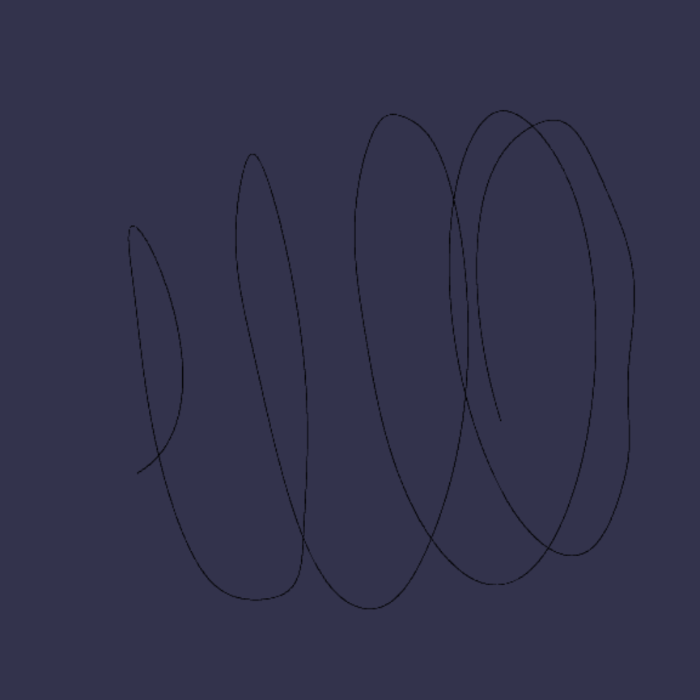
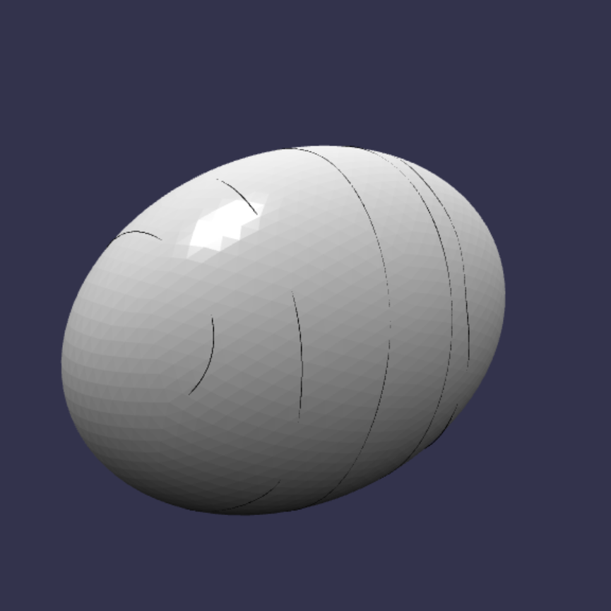

# autorigami

A library for algorithmic CAD of three-dimensional DNA nanostructures.

# Running

Install with
```
pip install .
```

## Contributing

Development and contributor workflow is documented in [CONTRIBUTING.md](/home/marcos/code/autorigami/CONTRIBUTING.md:1).

## Example Outputs




